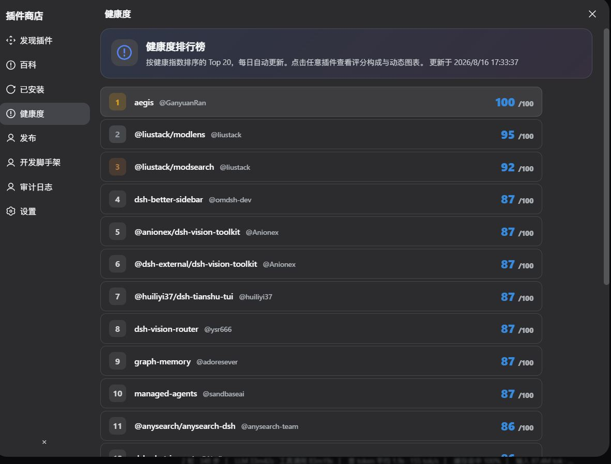
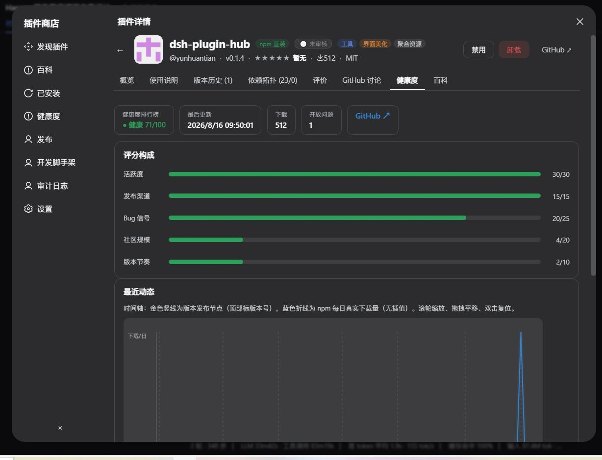
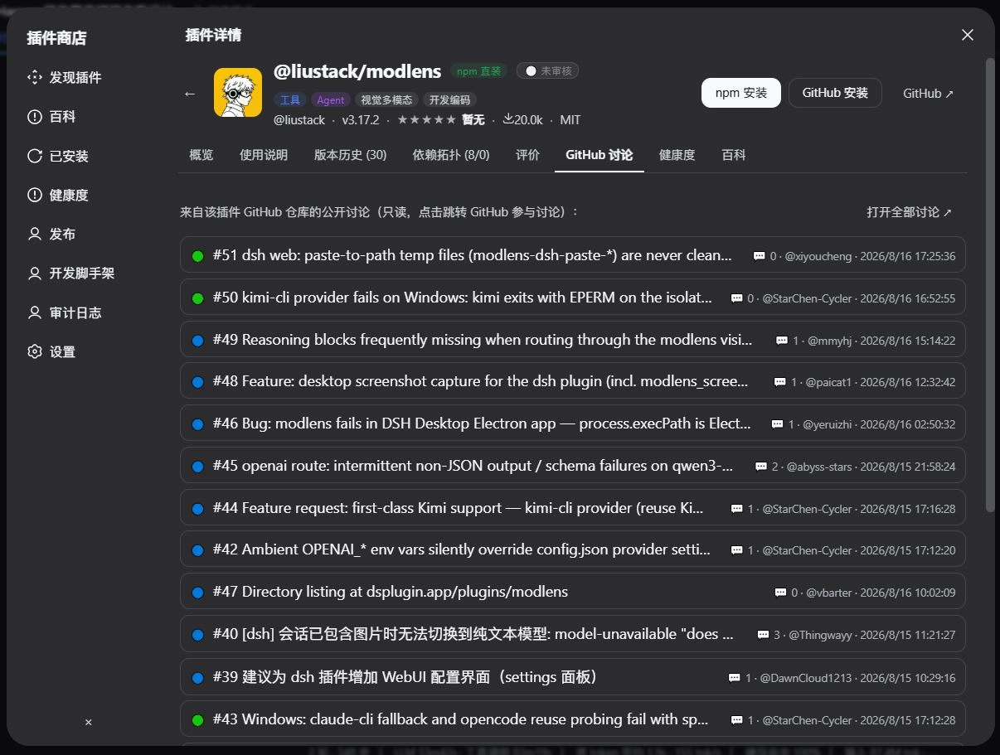

# dsh-plugin-hub — DeepSeek Harness 插件商店

一个深度集成于 **Harness Web UI** 的图形化插件商店：在原生界面中浏览、搜索、一键安装
GitHub 上的 DSH 插件（来源限定为标记 `topic: dsh-plugin` 或 `#dsh-plugin` 的仓库），
并内置本地评分评论、依赖拓扑评估、操作审计日志与插件开发脚手架引导。

## 预览

**商店主界面**：12 类分类筛选、卡片式列表、信任徽章、下载来源标注、一键安装


**健康度排行榜**：Top 20 健康指数每日随镜像同步更新，前三名金/银/铜


**详情页健康度 + 动态趋势图**：评分构成条 + 金色版本发布线 + 蓝色 npm 每日真实下载量折线


**GitHub 讨论区**：只读展示该插件仓库的 issue 讨论，一键跳转参与


## 功能总览

| 功能 | 说明 |
| --- | --- |
| 主界面入口按钮 | 侧边栏底部「插件商店」按钮，与常规功能按钮同尺寸（宽 34px / 窄栏 36px 圆形） |
| 图形化商店 | 卡片式列表：图标、名称、简介、开发者、评分、下载量；支持按 工具 / Agent / UI / 数据处理 分类筛选，按名称或描述关键词搜索，按评分 / 下载量 / 最近更新排序 |
| 插件详情页 | 完整 README、使用说明、版本历史（GitHub Releases）、依赖信息、截图；一键安装 / 卸载 / 启用 / 禁用，全程无需命令行 |
| GitHub Token 配置 | 设置页提供私人 Token 配置入口，缓解 GitHub API 限频（匿名搜索 10/min → 30/min，核心 60/h → 5000/h） |
| 定时镜像同步 | 定期将 `topic:dsh-plugin` / `#dsh-plugin` 仓库元数据同步至本地 SQLite 数据库（`$DSH_HOME/storages/plugin-store/`），搜索加载不受网络与限频影响；支持手动「立即同步」 |
| 本地评分与评论 | 企业内部用户可对插件 1-5 星打分并撰写使用反馈，与 GitHub 数据互补形成内部口碑（仅本机/本企业可见） |
| 依赖拓扑图 | 详情页可视化展示该插件依赖的底层库（红色入边）与被哪些上层插件依赖（蓝色出边），辅助卸载前评估影响范围 |
| 操作审计日志 | 完整记录谁在什么时间执行了安装、卸载、启用、禁用、评分、Token 配置、镜像同步等操作，可筛选查询，满足企业合规要求 |
| 插件开发脚手架 | 商店内置开发引导入口：插件结构说明、模板与官方文档链接、脚手架命令一键复制，鼓励内部开发者创建插件并打上 `dsh-plugin` 标签回馈生态 |
| 已安装插件管理 | 「已安装插件」页全新管理界面：系统插件 / 下载插件 / 自创作插件 三大分类，子分组折叠，switch 开关一键启用/禁用（无需卸载），分类级「全部启用 / 全部禁用」，核心组件（18 项基础设施）锁定保护防止误操作 |
| 自创作插件识别 | 本地安装（`file:` / `link:` / `workspace:`）的插件自动归入「自创作插件」分类（含改造他人的插件），显示本地源码路径与发布状态徽章（📦 已发布可跳转 npm/仓库 / 📝 未发布）；商店自身同样可在此管理并卸载 |
| 质量门（Quality Gate） | 安装前两道静态检查，从源头防止"装上就崩"：① 依赖完整性——扫描入口代码引用的外部模块，未声明且非平台提供（node: / @deepseek-ai/* 白名单）则拦截并自动回滚；② 目录需求——识别插件启动时读取的目录（如 `~/.codex/pets`），缺失则安装但保持禁用并明确提示创建目录 |
| 一键发布插件 | 「发布」页一键将本地自创作插件发布到 GitHub 仓库（建仓 + 推送代码 + topics + Release）与 / 或 npm：Markdown 图文介绍、公开 / 私人、标签选择，全程进度条；令牌会话级使用不落盘 |
| 发布安全扫描 | 发布前静态扫描生命周期脚本与源码：远程下载执行、环境变量外传、恶意依赖等 8 类高风险直接驳回，可疑项标注警告，杜绝恶意插件上线 |
| 下载来源标注 | 卡片与详情页显示「npm 直装」（绿）或「GitHub 源码」（红）徽标，明确告知安装是否需要代理 |
| 插件百科库 | 「百科」页 + 详情页百科 tab：自动提炼"能干什么 / 价值在哪 / 怎么用 / 最佳实践"，回答"这个插件有什么用"；接入 Blue-Whale 目录后覆盖 1900+ 条目；安装交给商店一键完成 |
| 健康度排行榜 | Top 20 插件健康指数（活跃度 / 发布渠道 / Bug 信号 / 社区规模 / 版本节奏），每日随镜像同步更新；详情页附评分构成与版本 / 下载 / 提交 / 加星动态趋势图（SVG 可缩放拖拽） |
| 信任徽章 | 对接 dsh-hub-index：🏅 官方 / ✅ 认证 / 👥 社区 / ⚪ 未审核 四层信任标记，数据落库缓存、源不可用自动降级 |
| Skill 商店 | 对话中可调用的技能市场：从全生态（dsh / Claude / Agent）收集 SKILL.md，一键安装进 `$DSH_HOME/skills/`，重启后对话中告诉 AI「用 xx 技能」即可调用；DSH 专用 / 通用 + 12 类用途双维分类筛选 |
| 安装安全与性能 | 装前质量门（依赖完整性）+ 冲突检查（槽位 / 激活补丁 / 依赖版本，被拦自动回滚）+ 已安装列表缓存与评分批量查询（L1 性能优化）；版本更新检测 + 已安装归属校验 |

## 更新日志

### 0.1.7（2026-08-17）

- **Skill 商店（大更新）**：全新「Skill 商店」导航——浏览、搜索、一键安装**对话中可调用的技能**（SKILL.md），参考 AI 助手自身的技能机制。安装后技能进入 `$DSH_HOME/skills/`，重启 dsh 即可在对话中告诉 AI「使用 xx 技能」直接调用（dsh 原生 skill-filesystem 自动发现）
- **全生态技能收录**：SKILL.md 是通用格式（Claude / Agent 生态统一），从 5 个 GitHub 主题（dsh-skill / claude-skills / agent-skills / skills / claude-skill）合并收集 150 仓库 → 首批 28 个技能（视频剪辑、代码测试、文档生成、网文检索等）
- **DSH 专用分类**：每个技能自动打两维标签——生态分类（🟦 DSH 专用 / ⚪ 通用，按仓库与描述含 dsh|deepseek 判定）+ 用途分类（12 类与插件商店同款，描述关键词推导）；支持组合筛选
- **Skill 详情**：SKILL.md 全文渲染 + 一键安装/卸载 + 「怎么在对话中调用」提示（复制调用指令）；安装附带同目录小文件（≤15 个）
- **修复**：client bundle 契约不同步导致的 `list rejected "filters"`（重建 client bundle）

### 0.1.6（2026-08-16）

- **防刷榜排序机制**：发现页默认改为「🎲 随机推荐」——每日种子伪随机（当天顺序稳定、次日自动轮换、无法预测），任何 star / 下载量 / 评分刷量都排不到前面；提供 7 种排序可选：随机 / 健康度 / Star 数 / 评分 / 下载量 / 最近更新 / 名称，选择自动记忆
- **排序支持按健康度**：列表每行附带健康度快照分（活跃度 / 发布渠道 / Bug 信号 / 社区规模 / 版本节奏），一键按健康度降序挑选靠谱插件
- **README 预览节**：新增 4 张精选截图（主界面 / 健康度排行榜 / 详情健康度趋势 / GitHub 讨论区）
- **修复**：客户端契约与 host 不同步导致的 `list rejected "filters"`（重建 client bundle）

### 0.1.5（2026-08-16）

- **插件百科库（大更新）**：全新「百科」页 + 每个插件详情页「百科」tab——回答"这个插件有什么用、实践中能体现什么价值"，而非安装教程（安装由商店一键完成）。内容自动从 README 提取：它能干什么 / 价值在哪（功能特性章节）+ 怎么用 + 最佳实践；安装命令收进折叠备查；底部同分类相关插件推荐
- **接入 Blue-Whale-Harness 目录**：百科库合并 1800+ 社区目录条目（去重后总计 1953 条）——431 个完整同步插件（详情/健康/信任全有）+ 1522 个目录索引（跳转 GitHub），广度与深度兼得；目录拉取失败保留旧缓存，脱离依赖可用
- **对接 dsh-hub-index 信任徽章**：🏅 官方 / ✅ 认证 / 👥 社区 / ⚪ 未审核 四层信任标记，显示在发现卡片与详情页；数据落库缓存，源不可用自动降级（显示旧缓存 / 不显示徽章 / 不阻断主流程）
- **插件健康度看板 → 健康度排行榜**：Top 20 健康指数（0-100，活跃度 30 / 发布渠道 15 / Bug 信号 25 / 社区规模 20 / 版本节奏 10），每日随镜像同步更新，前三名金/银/铜；排行榜与详情页分数统一（Top 候选拉真实 open issues 重算）
- **详情页健康度 + 动态趋势图**：评分构成条 + 指标面板 + SVG 时间轴（滚轮缩放 / 拖拽平移）——金色版本发布线、蓝色每日真实下载量、🔵 每日提交频次 + 🟡 每日加星增量双线图（加星需配置 GitHub Token，未配置明确提示）
- **GitHub 讨论区**：详情页「GitHub 讨论」tab 只读展示该插件仓库的 issue 讨论（🟢/🔵 状态徽章 + 评论数），点击跳转 GitHub，5 分钟缓存
- **L1 性能优化**：已安装列表 10s 缓存（刷新零磁盘 I/O）+ 评分批量查询（一条 SQL 替代逐包查询）——插件规模翻 10 倍依然流畅
- **安装冲突检查**：装前检测槽位冲突（独占 slot 撞车阻断，如 details）、激活补丁引用完整性（防 loader 崩溃）、依赖版本冲突（警告），被拦自动回滚
- **版本更新检测**：已安装列表显示「🔄 有新版本」徽章，详情页一键更新
- **已安装判定增强**：按 repository 归属校验，同名不同仓库不再误判
- **安装材料介入**：安装后提示插件需要的环境变量（API_KEY / TOKEN）
- **分类扩展 6 → 12 类**：新增视觉多模态 / 文档办公 / 记忆知识 / 模型用量 / 通知通讯 / 开发编码 / 对话会话 / 聚合资源，全库已重算
- **写操作限流**：安装 / 卸载 / 启停 / 发布 / 评分等操作应用层限流，防请求洪泛
- **Scaffold 更新 + 国际化**：开发脚手架改为"本地安装 → 商店一键发布"新路径，全部界面（含详情页 tab）中英双语
- **百科内容定位修正**：百科聚焦"能干什么 / 价值在哪"，用法提取不再混入安装命令


- **一键发布插件（最大更新）**：全新「发布」页——输入 GitHub / npm 令牌 → 选择本地自创作插件 → 填介绍（支持 Markdown 图文预览）→ 选择公开 / 私人 + 标签 → 一键发布到 GitHub 仓库（建仓 + 推代码 + topics + Release）和 / 或 npm，公开即上线，全生态可搜索安装
- **发布安全扫描**：发布前静态扫描插件（生命周期脚本 + 源码），高风险直接驳回（远程下载执行 / 环境变量外传 / 恶意依赖等 8 类），可疑项标注警告；扫描在令牌校验之前，零成本拦截
- **令牌会话级安全**：发布令牌仅本次使用、绝不持久化，每次发布需重新输入
- **下载量真实化**：移除估算公式，只显示 npm 官方真实下载量，未发布 npm 的插件显示「npm 未查询到」
- **框架级国际化**：商店界面（发现 / 已安装 / 发布 / 审计 / 设置 / 用量视图）全部支持中英双语，自动跟随 dsh 界面语言
- **安装进度条**：安装时实时显示下载百分比 / 阶段文字，git clone 阶段显示滚动动画
- **修复**：重复激活行导致 dsh 启动崩溃（幂等 upsert + 卸载清理）；publish 边界校验失败；git push 网络波动自动重试（3 次）+ postBuffer；发布介绍自动生成 README（不覆盖已有文档）

### 0.1.3（2026-08-15）

- **对话用量视图 tab**：与「对话 / 轨迹」并排，可视化每个长对话的 token 消耗——时间轴折线图（输入 / 输出 / 缓存命中率），可滚轮缩放、拖拽平移、双击复位
- **多模型费用估算**：按实际使用模型（DeepSeek / OpenAI / Claude / Gemini / Qwen 等）× 定价表实时计算费用，价格表带版本号与生效日期，未知模型不估算并提示
- **双下载源按钮**：详情页同时提供「npm 安装」与「GitHub 安装」两个按钮，都有就显示两个，只有一个就显示一个；GitHub 源安装失败自动 git clone 兜底
- **错误详情透出**：安装失败时「查看详情」展开 pnpm 完整报错，不再只显示笼统错误码
- **修复**：缓存命中率计算公式（不再出现 >100% 异常值）；GitHub 安装用默认分支而非 Release 版本号（解析失败根因）；Windows 下 pnpm 参数转义（消除 DEP0190）

### 0.1.1（2026-08-15）

- **已安装插件三分类管理**：系统插件 / 下载插件 / 自创作插件，子分组折叠 + switch 按钮化开关 + 分类级一键启停 + 18 个核心组件保护
- **质量门**：安装前依赖完整性检查（缺依赖自动回滚）+ 启动目录需求检查（缺目录装好禁用，防 deepseek-pet 类崩溃）
- **自创作插件**：本地安装（file:/link:/workspace:）自动识别，显示源码路径与发布状态徽章；改造他人的插件同样归入此类
- **商店自身可管理**：显示于自创作分类，可一键卸载（强确认）
- **下载来源标注**：npm 直装 / GitHub 源码徽标
- **修复**：禁用行使用真实 loader entry id；商店同步后可搜到自己

### 0.1.0（2026-08-14）

- 首个发布：图形化插件商店（浏览 / 搜索 / 筛选 / 一键安装）、本地评分评论、依赖拓扑图、操作审计日志、GitHub Token 配置、定时镜像同步、插件开发脚手架、下载来源标注

## 架构

- **Host 端**（Node / Cordis）：`lib/host/` — `PluginStoreService` 以
  Typert Remote（`pluginStore` 命名空间）暴露 17 个远程方法；`store-db.ts` 使用
  `node:sqlite` 持久化；`github.ts` 负责 GitHub 搜索与镜像同步；`installer.ts`
  通过 pnpm 完成安装/卸载，并写入 profile 的 `cordis.patch.yml`，由 Cordis HMR
  热加载生效（无需重启）。
- **Client 端**（React / 浏览器）：`lib/client.js` — 单文件 bundle，注册
  `sidebar.footer.action` 入口按钮与 `settings.section` 设置页，商店主体为
  portal 覆盖层，视觉与原生设置对话框一致（复用 `--dsw-*` 主题变量）。
- **契约**：`lib/contracts/remote.js` — zod v4 共享 wire 契约，同时导出
  `TYPERT_REMOTE`（客户端挂载）与 `TYPERT`（host 端注册）。

## 安装

```bash
# 方式一：npm 已发布，直接安装（推荐）
dsh plugin --profile web add dsh-plugin-hub

# 方式二：本地构建后安装（开发调试用，需要 node >= 22.19 与 pnpm）
pnpm install
pnpm build        # 产出 lib/host/*.js 与 lib/client.js
dsh plugin --profile web add <本包目录>
```

安装后侧边栏底部会出现「插件商店」按钮。首次使用请先在商店「设置」页点击
「立即同步」，将 GitHub 上的 dsh-plugin 仓库镜像到本地数据库。

## 开发

```bash
pnpm build:host   # tsc 编译 host 端
pnpm build:client # esbuild 打包 client bundle
pnpm typecheck
```

## 目录

```
src/
  contracts/remote.ts   # zod 共享契约（TYPERT_REMOTE / TYPERT）
  host/
    index.ts            # PluginStoreService（Typert Remote 服务 + 定时同步）
    store-db.ts         # SQLite 本地数据库（镜像缓存 / 评分 / 审计）
    github.ts           # GitHub 搜索 + 镜像同步管道
    installer.ts        # pnpm 安装/卸载 + profile 补丁热加载
    quality-gate.ts     # 质量门：依赖完整性 + 启动目录需求检查
  client/
    index.tsx           # 入口注册（按钮 / 设置页 / locale）
    StoreApp.tsx        # 商店模态框外壳
    views.tsx           # 发现 / 详情 / 已安装 / 设置 / 审计 / 脚手架
    graph.tsx           # 依赖拓扑 SVG
    markdown.tsx        # 轻量 markdown 渲染
    settings-section.tsx# 原生设置页（Token / 镜像）
    store.css           # 样式（--dsw-* 主题变量）
```

## 许可

MIT
